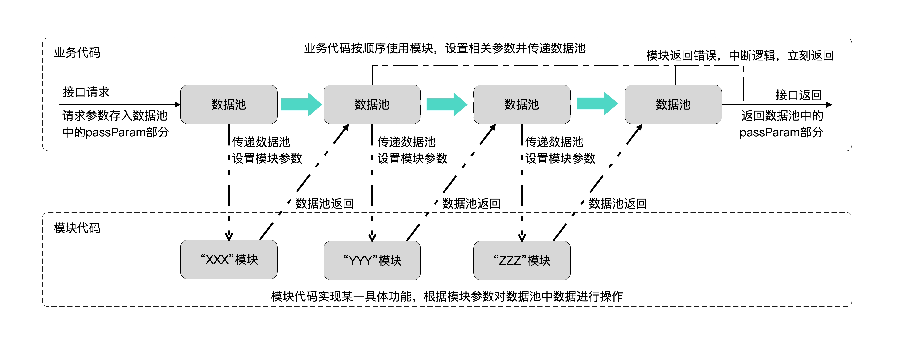
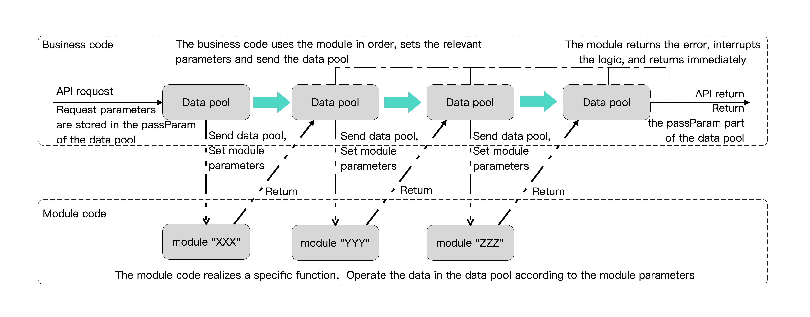

- 最新稳定版本: 3.0=2026.06.15
- 使用文档详见官网，[点击跳转使用手册](https://stoprefactoring.com/official/content?t=framework&p=once&i=overview-overview)

- Latest stable version: 3.0=2026.06.15
- For the user manual, please refer to the official website, [click here to open the manual](https://stoprefactoring.com/official/content?t=framework&p=once&i=overview-overview)

# 编写RESTful-API就像画流程图一样

**Once框架是后端服务框架，基于SpringBoot。**是“停止重构”系列框架的其中一员。

**直接使用SpringBoot框架有什么问题？**

在中大型项目里，团队往往只能按照功能点划分工作：每个人负责若干个API。这看起来分工明确，但实际开发过程中会出现很多**重复劳动和重复知识需求**：每个人都要了解Redis、MySQL等基础技术；每个人都要重复编写相似的调用代码；每个人也都会反复犯下相似的代码错误。

**这些隐性的重复成本，会逐渐让项目进度失控。在进度压力下，会继续加剧这些成本浪费**。再加上需求变更，会让本就一团乱麻的代码更加混乱。

**“停止重构”系列框架是“大象编程”方法论的衍生框架**。“大象编程”旨在重新定义软件工程的生产合作方式，关注的是团队开发效率和维护成本。目标不是“优雅的最佳实践”，而是消除重复劳动和重复知识需求，花更少的成本完成质量过硬的项目。

**Once框架将SpringBoot工程代码，分离出了业务代码和模块代码**。

**将大象放进冰箱需要几步？**三步，打开冰箱，把大象放进去，关上冰箱门。

**业务指的是流程步骤**，不关心具体问题的解决方案，比如以上的3步流程。业务代码由.xmas配置，无需编码调试（只有4个关键字，没有变量），可交由经验尚浅的程序员完成，无需了解过多开发知识。

**模块指的是某一类问题的具体解决方案**，不关心业务流程，比如如何才能将大象切块塞进冰箱。模块代码需要写Java代码，需要由一定经验的程序员完成。但是，只要复制粘贴模块文件夹，即可无条件复用多个项目，就像齿轮一样。我们也提供可一键下载的官方模块库。由于模块可无条件复用，所以模块可资产化积累，存在不需要开发模块的项目。

**单一职责，按需学习**。写业务的只管编排业务流程，不需要调试/理解代码，就像使用现成零件组装机械装置。写模块的只管自己的模块功能，也就是一个团队最多只需要1个人完全理解redis使用，就像专注于某个齿轮的制作。**工作可量化，无重叠工作或知识要求，模块可资产化积累，成本/质量自然可控**。

**吞噬生态，无黑盒代码**。Once框架实际上是Springboot工程的约束规则，无黑盒代码，所有问题都可以通过SpringBoot工程视角进行排查。SpringBoot所有的工具类或第三方库，都可以用作模块代码的编写。且由于模块代码隔离了业务，代码编写/调试会比直接使用SpringBoot更加快速/便捷。

# Writing a RESTful-API is like drawing a flowchart

**The Once framework is a backend service framework built on SpringBoot.** It is one of the frameworks in the "Stop Refactoring" series.

**What problems arise when using SpringBoot directly?**

In medium-sized and large projects, teams often have to divide work by functional scope: each person is responsible for several APIs. This may look like a clear division of labor, but in practice it creates a lot of **repeated work and repeated knowledge requirements**: everyone needs to understand infrastructure such as Redis and MySQL, everyone ends up writing similar integration code, and everyone tends to make similar coding mistakes.

**These hidden repeated costs gradually push the project schedule out of control. Under schedule pressure, those costs continue to compound.** When requirements change, the codebase becomes even harder to manage.

**The "Stop Refactoring" series is derived from the "Elephant Programming" methodology.** "Elephant Programming" aims to redefine how software teams collaborate, with a focus on development efficiency and maintenance cost. The goal is not "elegant best practices," but eliminating repeated work and repeated knowledge requirements so that teams can deliver solid projects at lower cost.

**The Once framework separates a SpringBoot project into business code and module code.**

**How many steps are needed to put an elephant into a refrigerator?** Three: open the refrigerator, put the elephant in, and close the door.

**Business refers to process steps.** It does not focus on the specific technical solution, just like the three steps above. Business code is configured with .xmas, requires no coding or debugging, and can be handled by less experienced developers. It uses only four keywords, has no variables, and keeps the focus on process logic.

**A module refers to a concrete solution for a certain type of problem.** It does not focus on the business process itself, just like figuring out how to cut the elephant into pieces and fit it into the refrigerator. Module code is written in Java and should be handled by developers with some experience. Once a module is written, however, it can be copied into other projects and reused directly like a gear. We also provide an official module library that can be downloaded with one click. Because modules can be reused directly, they can gradually accumulate as reusable assets, and some projects may not need new module development at all.

**Single responsibility, learn as needed.** Developers who work on business only need to arrange the business flow. They do not need to debug or fully understand the underlying code, just like assembling a machine with ready-made parts. Developers who work on modules only need to focus on their own module capabilities. In practice, that means a team may need only one person who fully understands Redis usage, just like one person focusing on building a specific gear. **Work becomes measurable, overlapping work and repeated knowledge requirements are reduced, modules can accumulate as reusable assets, and cost and quality become easier to control.**

**Built on the ecosystem, with no black-box code.** Once is essentially a SpringBoot project with an additional set of structural rules. There is no black-box code, and problems can still be investigated from a normal SpringBoot perspective. All SpringBoot utility classes and third-party libraries can be used directly in module development. Because module code is separated from business flow, development and debugging can also be faster and more straightforward than writing everything directly in SpringBoot.

# 基础技术

Once框架是一种规则，实际上是一个Springboot工程，框架本身只约束了工程结构和开发过程，对基础技术无任何改造和深度封装。

架构中采用的基础技术如下：

- **开发语言**：Java (JDK21或以上)
- **基础框架**：SpringBoot 4.0.6
- **项目自动构建工具**：Gradle

# Basic technology

The Once framework is essentially a set of rules built on top of a SpringBoot project. It only constrains project structure and development process, without modifying or deeply wrapping the underlying technologies.

The basic technologies used by the framework are as follows:

- **Development language**: Java (JDK21 or above)
- **Base framework**: SpringBoot 4.0.6
- **Project build tool**: Gradle

# 设计思想

从宏观上讲，后端应用程序是多个请求接口的集合。而对单个接口来讲，是多个步骤的集合。

以一个审核博客的接口为例，可以对其理解为：第一步“用户鉴权”、第二步“检查必要参数”、第三步“填充默认参数”、第四步“数据库操作”。

 

**Once框架将代码分离成了两层：模块代码、业务代码**。

**模块代码是实际执行功能的代码**，只关心通用功能的实现（脱离业务）。

**业务代码是业务流程的步骤**，也就是对模块使用顺序进行编排。

 

# Design ideas

From a macro perspective, a backend application is a collection of request APIs. For a single API, it is a collection of steps.

Take a blog review API as an example. It can be understood as four steps: first, user authentication; second, checking required parameters; third, filling in default parameters; fourth, database operations.

 

**The Once framework separates the code into two layers: module code and business code.**

**Module code is the code that performs actual functions.** It focuses only on implementing general capabilities, independent of any specific business flow.

**Business code represents the steps of a business flow.** In other words, it arranges the order in which modules are used.

 

# 工作原理

为了实现以上模块代码、业务代码分离，**Once架构加入了数据池**。

**数据池可以看作是一个API中的全局变量**，所有模块都可以对其进行添加、删除、获取数据。

数据池是`HashMap`类型的对象。

**具体工作原理为：**

- 在API逻辑开始时，将请求参数及其他重要对象存放在数据池中

- 接口逻辑调用模块时，需要设置模块参数，以及将数据池传递给模块

- 模块按模块参数执行任务时，可以对数据池中的数据进行添加、删除、修改。数据池被修改后，会被保留

- 模块执行任务完毕后，检查模块是否报错，不报错继续下一步；否则中断逻辑，返回结果

    > 线性调用、报错返回都只是默认行为，可以使用逻辑选择器改变默认行为

- API返回时，自动将数据池的数据转换为Json字符串，并返回客户端

 

# Working principle

To separate module code from business code, **the Once framework introduces a data pool**.

**The data pool can be understood as a global variable within an API.** All modules can add, remove, and retrieve data from it.

The data pool is a `HashMap` object.

**The working process is as follows:**

- At the beginning of API execution, request parameters and other important objects are stored in the data pool.

- When API logic calls a module, module parameters must be set and the data pool must be passed to the module.

- While executing according to its parameters, a module can add, remove, or modify data in the data pool. Those changes are preserved after execution.

- After a module finishes its task, the framework checks whether the module reported an error. If no error is reported, execution continues to the next step; otherwise, the process is interrupted and a result is returned.

    > Linear execution and returning on error are only the default behaviors. Logical selectors can be used to change them.

- When the API returns, the data in the data pool is automatically converted into a Json string and returned to the client.

 

# 历史版本
## 3.0
- [update]升级SpringBoot 4.0.6
- [update]业务代码由新语言.xmas编写，代替原来的json
- [update]移除returnParam
- [update]API返回，错误码字段'code'改为'$code'，错误信息字段'message'改为'$message'
- [update]代码结构调整
- [update]删除apiCode/
- [update]移除基础库fastjson2，使用SpringBoot内嵌的Jackson代替
- [update]移除@Service，所有业务逻辑集中在@Controller
- [update]版本文件Load.json改名Xmas.Sync.json
- [update]连结文件Once.Link改名Xmas.Link
- [update]自定义配置文件Once.Config改名Xmas.Config
- [update]Christmas命令/ShellExcute/Compile#Run 改名 /ShellExcute/Run#Run
- [update]Christmas命令/ShellExcute/Compile#War 改名 /ShellExcute/Run#Pack-War
- [update]Christmas命令/ShellExcute/Run#Module 改名 /ShellExcute/Run#Module
- [update]Christmas命令/ShellExcute/Module#Update 改名 /ShellExcute/Pull#Module
- [update]Christmas命令/ShellExcute/Update#Auto 改名 /ShellExcute/Pull#All
- [update]移除Christmas命令/ShellExcute/API#Delete
- [update]移除Christmas命令/ShellExcute/Module#Delete

## 2.2 (v2停止开源维护)
- [update]升级Christmas 2.3
- [bug]修复Windows下，Christmas及插件无法正常使用

## 2.1
- [update]业务代码（target.json）迁移到java代码同级目录
- [bug]当API请求方式为GET时，会对url参数进行多余的URL解码（报错）

## 2.0

- 升级Christmas 2
- 简化Controller、Service、Dao分层。Servcie层现为可选层，用作处理复杂接口；去除Dao层，将Dao层归为模块`_ServeDao`
- 模块迁移到新项目时，只需要复制文件夹
- 模块不再划分Controller/Service
- 模块新增初始化机制，如模块`_ServeDao`可自动获取数据库表属性，不再需要手工填写表属性
- 模块新增自动清理机制，如模块`_ServeDao`自动提交事务，`_OperFile`自动清理文件等
- 增加模块库功能，可通过Christmas下载/更新模块代码
- 请求参数不再限制在单层Json，支持多层嵌套Json
- 增加框架更新功能，可通过Christmas更新框架代码

## 1.0（停止维护）

- 严格按照Spring建议的Controller、Service、Dao分层
- 业务代码、模块代码分层
- 模块迁移时，只需要修改packeg位置
- 业务代码由Json配置，由代码生成器生成Java代码

# Historical version
## 3.0
- [update] Upgraded to SpringBoot 4.0.6
- [update] Business code is now written in the new .xmas language instead of the original Json
- [update] Removed returnParam
- [update] In API responses, the error code field `code` was renamed to `$code`, and the error message field `message` was renamed to `$message`
- [update] Adjusted the code structure
- [update] Removed apiCode/
- [update] Removed the fastjson2 dependency and replaced it with the Jackson support built into SpringBoot
- [update] Removed @Service, with all business logic now concentrated in @Controller
- [update] Renamed version file Load.json to Xmas.Sync.json
- [update] Renamed link file Once.Link to Xmas.Link
- [update] Renamed custom config file Once.Config to Xmas.Config
- [update] Renamed Christmas command /ShellExcute/Compile#Run to /ShellExcute/Run#Run
- [update] Renamed Christmas command /ShellExcute/Compile#War to /ShellExcute/Run#Pack-War
- [update] Renamed Christmas command /ShellExcute/Run#Module to /ShellExcute/Run#Module
- [update] Renamed Christmas command /ShellExcute/Module#Update to /ShellExcute/Pull#Module
- [update] Renamed Christmas command /ShellExcute/Update#Auto to /ShellExcute/Pull#All
- [update] Removed Christmas command /ShellExcute/API#Delete
- [update] Removed Christmas command /ShellExcute/Module#Delete

## 2.2 (V2 stops open source maintenance)
- [update] Upgrade to Christmas 2.3
- [bug] Fixed the issue where Christmas and plugins could not be used normally under Windows

## 2.1

- [update] Business code (target.json) is migrated to the same-level directory of java code
- [bug] When the API request method is GET, the url parameters will be decoded (error)

## 2.0

- Upgrade Christmas 2

- Simplify the layering of Controller, Service and Dao. The Servcie layer is now an optional layer, which is used to handle complex interfaces; remove the Dao layer and classify the Dao layer as a module `_ServeDao`

- When the module is migrated to a new project, you only need to copy the folder

- The module is no longer divided into Controller/Service

- A new initialization mechanism is added to the module. For example, the module `_ServeDao` can automatically obtain database table attributes, and there is no need to fill in the table attributes manually

- A new automatic cleaning mechanism has been added to the module, such as the module `_ServeDao` automatic submission of transactions, `_OperFile` automatic cleaning of files, etc

- Add the function of module library to download/update module code through Christmas

- Request parameters are no longer limited to single-layer Json, and multi-layer nested Json is supported

- Add the framework update function and update the framework code through Christmas

## 1.0 (stop maintenance)

- Strictly follow the Controller, Service and Dao recommended by Spring

- Business code, module code layering

- When the module is migrated, you only need to modify the package location

- The business code is configured by Json, and the Java code is generated by the code generator
